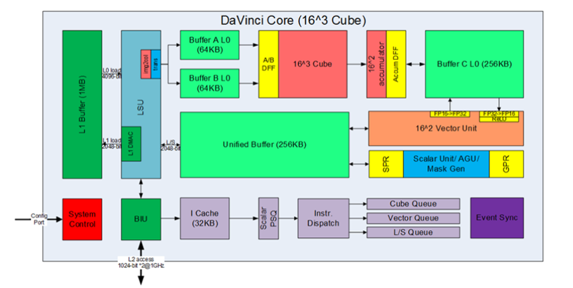

# TVM Learning for Huawei Ascend

Mu Li's tutorial: http://tvm.d2l.ai.s3-website-us-west-2.amazonaws.com/

##Define tensor computation graph

* placeholder, compute
* var: to define shapes
* reduce_axis: for reduction operation
  * comm_reducer: for user defined reduce function
* if_then_else:  conditional expression
  * all & any: for complex conditional expression
* create_schedule: generate IR

## TVM Scheduling

### Scheduling on CPU

#### E.g. Matrix Multiplication

```python
def tvm_mm(n):
    A, B, C = d2ltvm.matmul(n, n, n)
    s = tvm.create_schedule(C.op)
    # Create a write cache for C
    CachedC = s.cache_write(C, 'local')
    # Same as before, first tile by blocks, and then parallelize the
    # computation of each block
    xo, yo, xi, yi = s[C].tile(*C.op.axis, tx, ty)
    xy = s[C].fuse(xo, yo)
    s[C].parallel(xy)
    # Use the write cache for the output of the xy axis, namely a block.
    s[CachedC].compute_at(s[C], xy)
    # Same as before to optimze the computation of a block .
    xc, yc = s[CachedC].op.axis
    ko, ki = s[CachedC].split(CachedC.op.reduce_axis[0], factor=tk)
    s[CachedC].reorder(ko, xc, ki, yc)
    s[CachedC].unroll(ki)
    s[CachedC].vectorize(yc)
    return s, (A, B, C)
```

### Scheduling on GPU

Official tutorial: https://docs.tvm.ai/tutorials/language/schedule_primitives.html

#### E.g. Vector Addition

```python
nt = 64  # number of threads in a block

def parallel(n):
    A, B, C = d2ltvm.vector_add(n)
    s = tvm.create_schedule(C.op)
    bx, tx = s[C].split(C.op.axis[0], factor=nt)
    s[C].bind(bx, tvm.thread_axis("blockIdx.x"))
    s[C].bind(tx, tvm.thread_axis("threadIdx.x"))
    return s, (A, B, C)
```

#### E.g. Matrix Multiplication

cache_read can create a read-only cache for  𝐴  that will be used by  𝐶  on the shared memory, i.e. `s.cache_read(A, "shared", [C])`

```python
# Save into the d2ltvm package.
def split(stage, axis, factors):
    """Split an axis by a list of factors in a reverse order
    """
    axes = []
    for f in reversed(factors):
        axis, x = stage.split(axis, f)
        axes.append(x)
    return list(reversed(axes+[axis]))

# Save into the d2ltvm package.
def bind_thread(stage, axes, tags):
    """Bind a list of axes to thread axes
    """
    for axis, tag in zip(axes, tags):
        stage.bind(axis, tvm.thread_axis(tag))
```

```python
block_size = 16  # the number of threads for one dimension in a thread block.
tx, ty, tk = 8, 4, 32  # tile sizes for one CUDA thread
```

```python
def matmul_gpu(n):
    A, B, C = d2ltvm.matmul(n, n, n)
    s = tvm.create_schedule(C.op)
    # Create caches
    A_shared = s.cache_read(A, "shared", [C])
    A_local  = s.cache_read(A_shared, "local", [C])
    B_shared = s.cache_read(B, "shared", [C])
    B_local  = s.cache_read(B_shared, "local", [C])
    C_local = s.cache_write(C, "local")
    # Split each axis into block axis, thread axis, and inner axis
    x, y = s[C].op.axis
    xb, xo, xi = split(s[C], x, (block_size, tx))
    yb, yo, yi = split(s[C], y, (block_size, ty))
    s[C].reorder(xb, yb, xo, yo, xi, yi)
    # Note that we bind yb to blockIdx.x instead of blockIdx.y
    bind_thread(s[C], (yb, xb, yo, xo),
                ("blockIdx.x", "blockIdx.y", "threadIdx.x", "threadIdx.y"))
    # Schedule C_local
    s[C_local].compute_at(s[C], yo)
    yi, xi = s[C_local].op.axis
    k, = s[C_local].op.reduce_axis
    ko, ki = s[C_local].split(k, tk)
    s[C_local].reorder(ko, ki, yi, xi)
    # Optimize read caches of A and B with cooperative fetching
    def optimize_read_cache(shared, local):
        s[shared].compute_at(s[C_local], ko)
        s[local].compute_at(s[C_local], ki)
        y, x = s[shared].op.axis
        # Note that we must split into block_size parts to reuse
        # the previous axis threads
        yo, yi = s[shared].split(y, nparts=block_size)
        xo, xi = s[shared].split(x, nparts=block_size)
        s[shared].reorder(yo, xo, yi, xi)
        bind_thread(s[shared], (yo, xo), ("threadIdx.y", "threadIdx.x"))
    optimize_read_cache(A_shared, A_local)
    optimize_read_cache(B_shared, B_local)
    return s, (A, B, C)
```

### Scheduling on Ascend NPU



NPU Info: dtype = float16, UB = 256KB, data per pass = 64KB

* cache_read与cache_write需要成对出现，功能是对tensor所在的buffer进行映射。由于在TVM中，生成的tensor默认在DDR中，但对于昇腾AI处理器，计算在AI Core的UB中，所以需要将tensor从DDR搬运到UB进行计算，再将计算结果从UB搬回DDR。

  * scope_cbuf: L1
  * scope_ca: L0A
  * scope_cb: L0B
  * scope_cc: L0C
  * scope_ubuf: UB
  * scope_reg: REG，是TBE定义的特殊scope，对应于局部变量。

  [*Question*] will data on DDR automatically move to UB for computation?

* allocate_at 将一个stage的操作手动allocate到另一个stage的某根轴上，allocate_at需要配合compute_at使用，主要目的是一次开辟较大的Nbuffer

  ```python
  s[valueA_UB].allocate_at(s[out], out.op.axis[0], run_once_axes=[out.op.axis[0], out.op.axis[1]])
  ```

  IR without allocate_at:

  ```c
  ...
      for (i, 0, 16) {
        for (j, 0, 16) {
          // attr [compute(valueA.local.UB, 0x563ad6cb6930)] realize_scope = "local.UB"
          realize valueA.local.UB([i, ((i + 1) - i)], *****[j, ((j + 1) - j)]*****, [0, 16], [0, 16])
  ...
  ```

  IR with allocate_at:

  ```c
  ...
     for (i, 0, 16) {
     // attr [compute(valueA.local.UB, 0x5618fc5ae210)] realize_scope = "local.UB"
     //realize上提至allocated at指定轴
        realize valueA.local.UB([i, ((i + 1) - i)], *****[0, 16]*****, [0, 16], [0, 16]) {
          for (j, 0, 16) {
  ```

  当allocate_at与double buffer一起使用时，double buffer变为在allocate at指定轴展开。

* buffer_tile及buffer_align都是对root轴（即compute定义的轴）进行的操作，指定它compute_at之后每次循环的范围。

  * 例如，对于一个2维的tensor A：

    s[A].buffer_tile((i0.var, 32), (0,16))

    表示对于2个for循环的范围，第一个for循环的min指定为i0.var，extent指定为32；第二个for循环的min指定为0，extent为16。

  * 例如，对于一个2维的tensor B

    s[B].buffer_align((1, 32), (1, 16))

    表示对于2个for循环的范围，第一个for循环的min对齐到1的倍数，extent对齐到32的倍数；第二个for循环的范围min对齐到1的倍数，extent对齐到16的倍数。

* reused_by(tensors), mem_unique()

  * 例如sch[A].reused_by(B, C, D)，指将A、B、C 、D当做一个整体来分配内存，tensor B、C、D直接复用tensor A的buffer，其中（B,C,D）的个数可以是>=1的任意数目。
  * 例如：sch[E].mem_unique() ，表示buffer E内存全局唯一，不和其他buffer做内存复用

* **double_buffer**: 主要功能是开启指定buffer的**ping、pong**流水线，即通过双缓存方式进行当前计算。开启double_buffer后，会自动生成两个UB空间，将数据分别搬入以减少读写冲突。

  * sch[A_buffer].double_buffer()，功能是开启A_buffer在当前for循环内部的ping、pong流水。

    *Note*： 当前版本只支持在当前for循环内部开启doule_buffer，不支持在for循环变量为1的轴下开启double_buffer。

  double_buffer将指定for循环轴下的变量开启ping、pong流水，使得循环变量减半，结果如下所示：

  ```
  for (1, n) {
    A       //开启double_buffer
    ...
    B
    C      //开启double_buffer
  }
  ```

  分别开启A与C的double_buffer后，结构如下所示：

  ```
  for (1, n/2) {
    A0
    ...
    B
    C0
    A1
    ...
    B
    C1
  }
  ```

* preload 功能是将double_buffer中的ping的内存提到当前for循环之外。

  * s[AL1].preload() 将带有preload()标签的部分外提，外提部分用double_buffer的ping内存块，目前只支持外提一个轴（外提到当前for循环之外）

* **bind:** 把某根轴和线程轴进行绑定，用于实现多核计算。

  ```python
   shape = [2,1024]
   A = tvm.placeholder(shape, name="A", dtype=dtype)
   B = tvm.compute(shape, lambda i,j: A[i,j]*2, name="B")
   s = tvm.create_schedule(B.op)
   thread_block = tvm.thread_axis("blockIdx.x")
   s[B].bind(B.op.axis[0], thread_block)
  ```

  内层循环（即内层轴）可以直接通过一个指令实现，外层循环（即外层轴）可以使用多核方式实现，提高计算效率。实现方法为：将B的轴0与昇腾AI处理器的并行计算轴（blockIdx.x）绑定。

  thread_block = [tvm.thread_axis](https://docs.tvm.ai/api/python/tvm.html?highlight=thread_axis#tvm.thread_axis)("blockIdx.x")：创建一个新的线程块变量表示并行计算的轴，thread_block为线程变量的变量名，blockIdx.x表示当前线程块的标记，用户自定义即可。

  s[B].bind(B.op.axis[0], thread_block)：将B的轴0与并行计算轴进行绑定。

  对应的IR表示如下：

  ```c
  produce B {
    // attr [iter_var(blockIdx.x, , blockIdx.x)] thread_extent = 2
    for (j, 0, 1024) {
      B[((blockIdx.x*1024) + j)] = (A[((blockIdx.x*1024) + j)]*2.000000h)
    }
  }
  ```

  即原来的外层轴2使用thread_extent=2进行实现，表示两个线程并行执行。

#### Intrinsics Mapping:

```python
s[vlog_tL].emit_insn(li, 'vector_ln') 
s[vmuls_tL].emit_insn(mi, 'vector_muls') 
s[vexp_tL].emit_insn(ei, 'vector_exp')

s[dataL].emit_insn(di, 'dma_copy') 
s[vexp_t].emit_insn(xi, 'dma_copy')
```

#### Scheduling Optimization

**Data Tiling**

**Multi-Block**

**Double Buffer**